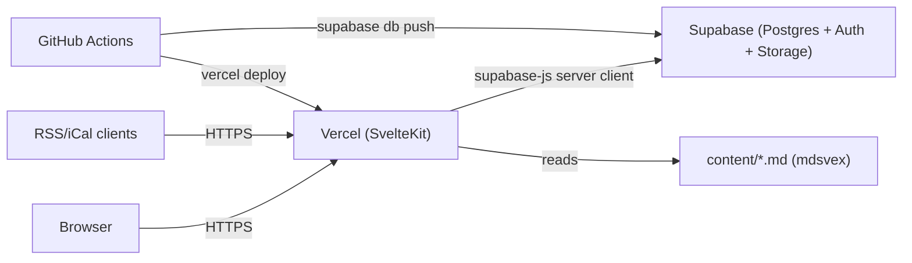
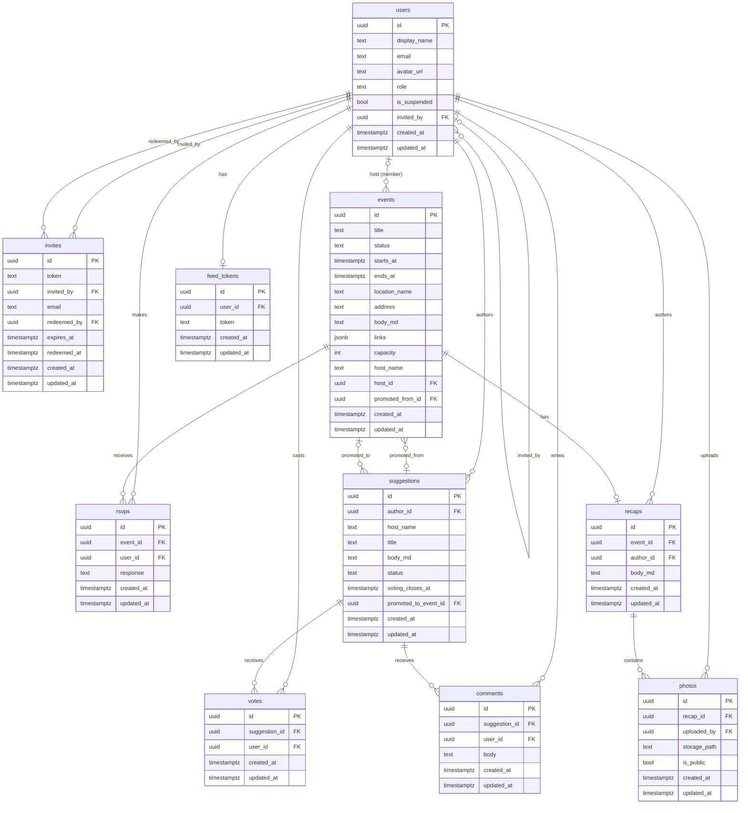
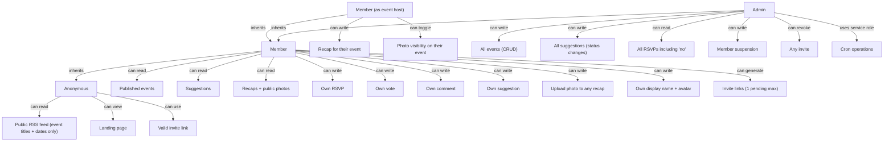
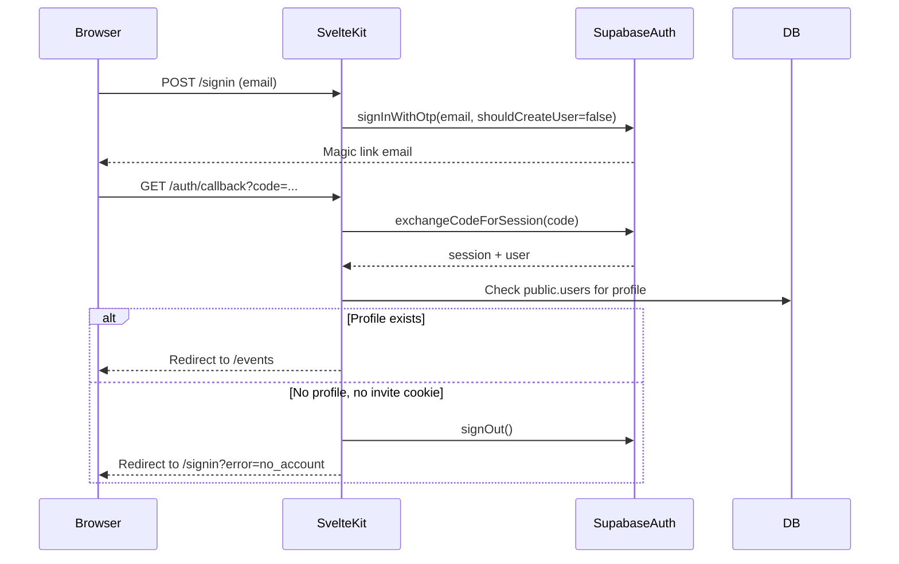
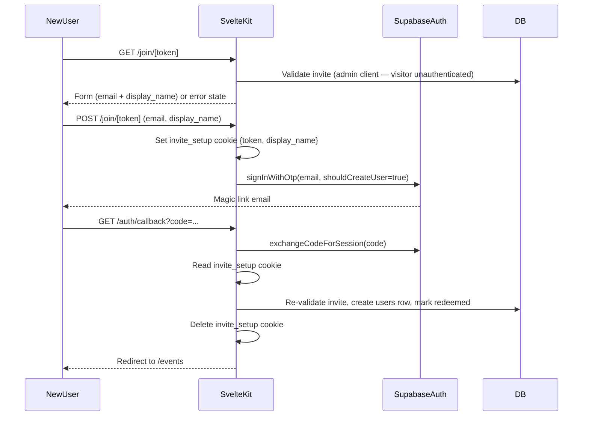
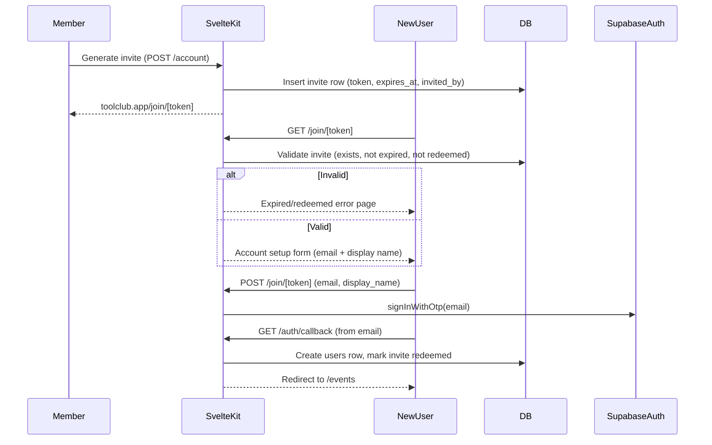
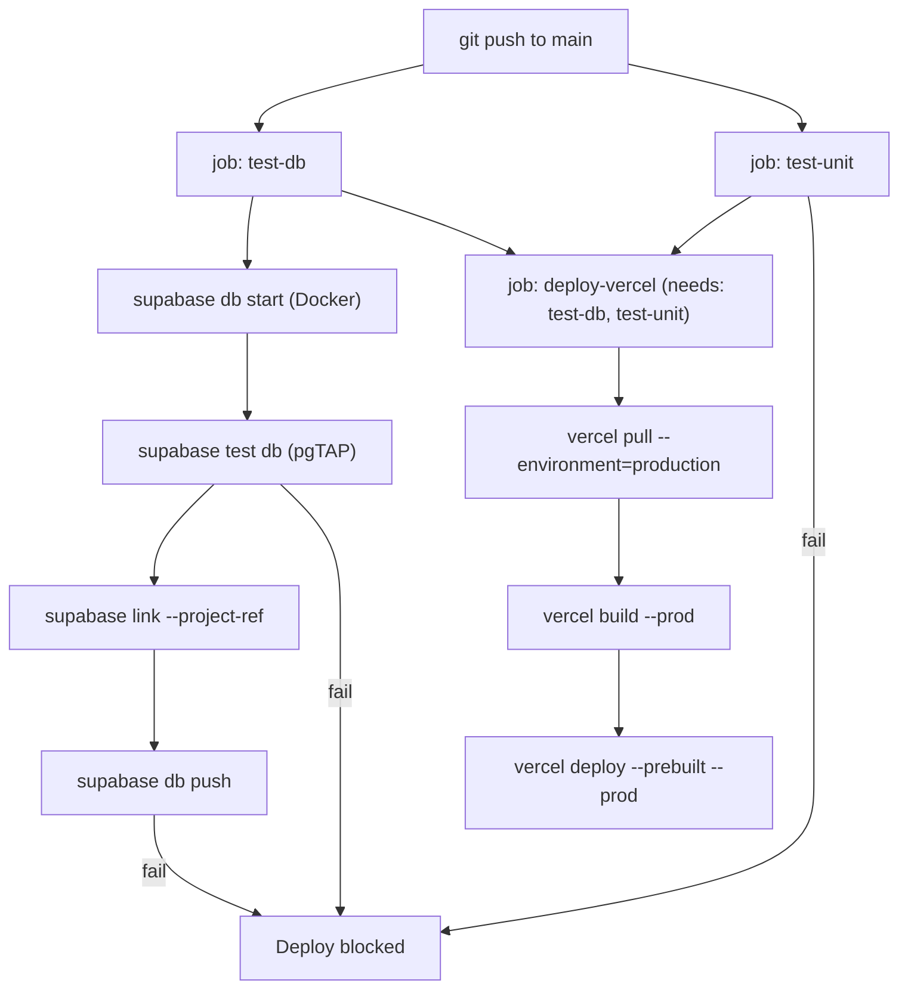

# ARCHITECTURE.md — Tool Club

Last updated: 2026-04-09
Status: Authoritative. Update this file when any architectural decision changes.

---

## System overview

Tool Club is a SvelteKit application backed by Supabase (PostgreSQL + Auth + Storage)
and deployed on Vercel. It is a private, invite-only social app for a small community.
There is no separate API server. SvelteKit server routes and form actions are the
backend layer.



---

## Stack decisions

### SvelteKit

Chosen to build Svelte fluency through a real project. All routing, SSR, and server
logic lives here. No separate backend framework.

### Supabase

Single vendor for database (PostgreSQL), auth (magic link), and file storage.
Chosen over separate services (e.g. PlanetScale + Clerk + S3) to minimize integration
surface. Local development runs the full stack via `supabase start` (Docker required).

### Vercel

Hosts the SvelteKit app via `@sveltejs/adapter-vercel`. Cron jobs run as Vercel
Functions with cron triggers. The SvelteKit adapter handles SSR, edge functions,
and static assets.

### Supabase Auth (not Clerk or Auth.js)

Magic-link auth is a first-class Supabase Auth feature. Session is in the same system
as all data, enabling Row Level Security policies that reference `auth.uid()` directly.
No JWT bridging between vendors.

### TanStack Form (`@tanstack/svelte-form`)

Used for client-side form state management and field-level validation. Integrates with
Zod via the Standard Schema spec. The pattern is:

- TanStack Form validates fields on the client (onChange/onBlur, before submission)
- On `handleSubmit`, the validated values are posted to a SvelteKit form action via
  `fetch('/page-path', ...)`. The response is handled manually in local `$state`.
- The SvelteKit action re-validates server-side and performs the mutation
- Do NOT use `fetch('?/actionName', ...)` or call `applyAction` from TanStack's
  `onSubmit` — both trigger Svelte 5 reactive re-renders that cause
  `lifecycle_outside_component` due to TanStack Form's use of `onMount` internally.
  See `src/AGENTS.md` for the full explanation and correct pattern.

This means forms require JavaScript. Progressive enhancement (no-JS fallback) is not
supported for mutating actions. This is an acceptable trade-off for Tool Club's
invite-only, small-group audience.

Zod schemas in `src/lib/schemas/` serve double duty: used by TanStack Form for
client-side validation and by the server action for server-side validation.

### mdsvex

Markdown content (landing page, about page) is processed by mdsvex at build time.
Content lives in `content/` as `.md` files, imported into pages as Svelte components.
No CMS. The `$content` alias (`svelte.config.js` → `kit.alias`) maps to the root
`content/` directory.

Runtime markdown (event bodies, recap bodies, suggestion bodies) is rendered
server-side using the `marked` library, not mdsvex. mdsvex is for static content
files only.

### MJML (email templates)

Email templates are authored in MJML and compiled to HTML by a custom Vite plugin
defined in `vite.config.ts`. Compilation runs on every `pnpm dev` and `pnpm build`.

```
supabase/email-templates/*.mjml   ← source of truth
supabase/templates/*.html         ← compiled output (committed)
```

Compiled HTML is committed so `config.toml` template references always resolve
without a separate build step. Edit only the `.mjml` source files.

To push compiled templates to the production Supabase project:

```bash
SUPABASE_ACCESS_TOKEN=... SUPABASE_PROJECT_ID=... pnpm push:emails
```

This is a deliberate manual step — never automated in CI. Email template
changes affect authentication flows and are not easily rolled back.

Go template variables (`{{ .ConfirmationURL }}`, `{{ .SiteURL }}`) pass through
MJML v4 href attributes unchanged (MJML bug fixed in v4.0.0-beta.2).
`{{ .Token }}` (OTP code) is intentionally omitted — there is no `/verify` page
to enter it, and showing an unusable code confuses users. Add it back if a
`/verify` route is ever built.

### Tailwind CSS v4

Tailwind v4 is used for styling. The v4 integration model differs significantly from
v3 — do not apply v3 patterns:

- Install via `@tailwindcss/vite` (Vite plugin), not PostCSS.
- No `tailwind.config.js`. Configuration is CSS-first via a `@theme` block in
  `src/app.css`.
- Import with `@import "tailwindcss"` in `src/app.css`.
- Design tokens are defined as CSS custom properties inside `@theme`. This makes them
  available both as Tailwind utilities and as raw `var(--tc-*)` values in component
  styles.
- Dark mode token overrides are defined in a standard `@media (prefers-color-scheme: dark)`
  block targeting `:root`, not inside `@theme`. `@theme` is for static token
  registration only.
- Do not add UnoCSS, Bootstrap, or any other CSS framework alongside Tailwind.

---

## Environment variables

All secrets are environment variables. Never hardcode.

| Variable                    | Used in         | Purpose                              |
| --------------------------- | --------------- | ------------------------------------ |
| `PUBLIC_SUPABASE_URL`       | Client + server | Supabase project URL                 |
| `PUBLIC_SUPABASE_ANON_KEY`  | Client + server | Supabase anon key (safe to expose)   |
| `SUPABASE_SERVICE_ROLE_KEY` | Server only     | Bypass RLS for admin/cron operations |
| `VERCEL_TOKEN`              | CI only         | Vercel deploy from GitHub Actions    |

Note: `SUPABASE_JWT_SECRET` is not used. The app uses `@supabase/ssr` and never
verifies JWTs directly. The hosted project uses ECC P-256 asymmetric signing keys.

`PUBLIC_` prefix makes variables available client-side in SvelteKit. Non-prefixed
variables are server-only.

The service role key bypasses RLS. It is used only in:

- Cron job functions
- Admin-only server actions (with a secondary role check in application code)

Never use the service role key in a load function or action reachable by non-admins.

---

## Data model



### Key field notes

**users.role**: `member` or `admin`. Admins are set directly in the database. There
is no self-service role elevation. RLS prevents members from updating their own role.

**users.invited_by**: FK to users. Set at account creation time. Preserved even if
the inviter later deletes their account (the inviter row is anonymized, not deleted).

**events.host_name**: Required freeform text. Allows external (non-member) hosts.

**events.host_id**: Optional FK to users. Set when the host is a member. Enables the
"host can write recap" rule. Queried with a left join — `host_name` is the display
value, `host_id` is for permission checks.

**events.links**: `jsonb` array of `{label: string, url: string}` objects. Nullable,
defaults to `[]`.

**events.status**: `draft` | `published` | `past`. Drafts are not visible to members.
`past` is set by a cron job when `starts_at` is more than 24 hours ago.

**events.promoted_from_id**: FK to suggestions. Set when an event is created from a
suggestion. Paired with `suggestions.promoted_to_event_id` — both are set atomically
in the promote action.

**suggestions.host_name**: Freeform text. The member who proposed the suggestion
nominates a host by name. Not a FK — the nominee may or may not be a member.

**suggestions.promoted_to_event_id**: FK to events. Set when status becomes `planned`.
Paired with `events.promoted_from_id`.

**suggestions.status**: `open` | `planned` | `closed`. `planned` means it was promoted
to an event. Admin sets status.

**rsvps.response**: `yes` | `no`. No "maybe." Members can change their RSVP until
the event starts. One RSVP per (event, user) pair — enforced by unique constraint.

**invites.token**: Random string generated by the application. Forms the invite URL.
Single-use, expires after 30 days. `redeemed_by` is null until used. Revoking
hard-deletes the row.

**feed_tokens**: One per user (unique constraint on user_id). Regenerating deletes
the old row and inserts a new one. Token is a random string, not a JWT.

**photos.is_public**: Controls whether a photo appears in the public RSS feed.
Toggled by the event host after upload.

---

## Permission model



### RLS policy summary

| Table       | anon | member                                  | admin |
| ----------- | ---- | --------------------------------------- | ----- |
| users       | none | select (active members)                 | all   |
| events      | none | select where status=published           | all   |
| rsvps       | none | select yes-responses; insert/update own | all   |
| suggestions | none | select all; insert own                  | all   |
| votes       | none | select all; insert/delete own           | all   |
| comments    | none | select all; insert own                  | all   |
| recaps      | none | select all                              | all   |
| photos      | none | select all; insert own                  | all   |
| invites     | none | insert own; select own                  | all   |
| feed_tokens | none | select/update own                       | all   |

"no" RSVP responses are readable only by admins and the RSVP owner.
`photos.is_public` is NOT enforced by RLS — all authenticated members can see all
photos. The flag is an application-layer filter used only by the public RSS feed
endpoint to decide which photos to include.

---

## Routing structure

Routes marked ✓ are built. Unmarked routes are planned.

```
src/routes/
├── +layout.server.ts        ✓ Auth guard, profile fetch
├── +layout.svelte           ✓ App shell, sidebar nav, mobile nav
├── +page.svelte             ✓ Landing (public, content from content/landing.md)
├── signin/
│   ├── +page.server.ts      ✓ Magic link action
│   └── +page.svelte         ✓
├── signout/
│   └── +server.ts           ✓ POST — signs out, redirects to /
├── auth/
│   └── callback/
│       └── +server.ts       ✓ Code exchange, profile creation, invite redemption
├── join/
│   └── [token]/
│       ├── +page.server.ts  ✓ Invite validation + account setup
│       └── +page.svelte     ✓
├── events/
│   ├── +page.server.ts      ✓ Load published events
│   ├── +page.svelte         ✓
│   └── [id]/
│       ├── +page.server.ts  ✓ Load event + RSVP state, rsvp action
│       └── +page.svelte     ✓
├── suggestions/
│   ├── +page.server.ts      ✓ Sorted by votes, status sections
│   ├── +page.svelte         ✓
│   ├── new/
│   │   ├── +page.server.ts  ✓ Propose suggestion form action
│   │   └── +page.svelte     ✓
│   └── [id]/
│       ├── +page.server.ts  ✓ Vote toggle, comment actions
│       └── +page.svelte     ✓
├── feed/
│   ├── rss/
│   │   └── +server.ts       ✓ Private RSS (token auth)
│   ├── ical/
│   │   └── toolclub.ics/
│   │       └── +server.ts   ✓ Private iCal (token auth, .ics URL for calendar app compat)
│   └── public/
│       └── +server.ts       ✓ Public RSS (titles + dates only, no auth)
├── account/
│   ├── +page.server.ts      ✓ Display name, avatar upload, invites, feed tokens, deletion
│   └── +page.svelte         ✓
└── admin/
    ├── +layout.server.ts      ✓ Admin role guard (redirects non-admins to /events)
    ├── +page.server.ts        ✓ Home — draft event count, pending invite count
    ├── +page.svelte           ✓
    ├── events/
    │   ├── +page.server.ts    ✓ All events across all statuses
    │   ├── +page.svelte       ✓
    │   ├── new/
    │   │   ├── +page.server.ts ✓ Create event form action
    │   │   └── +page.svelte    ✓
    │   └── [id]/
    │       ├── +page.server.ts ✓ Edit event, RSVP list; update + delete actions
    │       └── +page.svelte    ✓
    └── members/
        ├── +page.server.ts    ✓ Member list + pending invites; suspend, reinstate, revokeInvite actions
        └── +page.svelte       ✓
```

Auth guard lives in the root `+layout.server.ts`. Routes under `/admin/` have a second
guard in `admin/+layout.server.ts` that checks `users.role = 'admin'`. Non-admins are
redirected silently to `/events` (not 403 — avoids confirming admin routes exist).

---

## Auth flow

### Existing member sign-in



### New member invite flow



Session is validated in `hooks.server.ts` via `supabase.auth.getUser()` (server-
verified, not cookie-only). Every request sets `locals.user` and `locals.session`.

---

## Invite flow



Invite tokens are separate from auth tokens. The invite token gates account creation;
Supabase Auth handles the actual authentication.

---

## Feed and calendar architecture

Feed URLs are authenticated via a per-user token stored in `feed_tokens`. The token
is a random string passed as a query parameter, not a session cookie. This allows
RSS readers and calendar apps to subscribe without a browser session.

```
/feed/rss?token=mk_7f3a9c...     → Authenticated RSS (all events, recaps)
/feed/ical?token=mk_7f3a9c...    → Authenticated iCal (event dates + details)
/feed/public                     → Public RSS (titles + dates only, no auth)
```

Token regeneration invalidates existing subscriptions. This is surfaced clearly in
the UI before the user confirms.

Feed endpoints are `+server.ts` routes that return `Response` objects with
appropriate `Content-Type` headers (`application/rss+xml`, `text/calendar`).

---

## Cron jobs

Cron jobs run as Vercel Functions with cron triggers, configured in `vercel.json`.

| Job                | Schedule | Action                                                                       |
| ------------------ | -------- | ---------------------------------------------------------------------------- |
| `mark-past-events` | Daily    | Set `events.status = 'past'` where `starts_at < now() - interval '24 hours'` |

Daily cadence is the maximum allowed on Vercel's Hobby plan. Expired invites are
not cleaned up by cron — the app rejects them at the route level, so accumulation
is harmless and a cron is not worth the plan upgrade.

Cron functions use the Supabase service role key. They are not reachable by members.

Cron endpoints are protected by `CRON_SECRET`. Vercel automatically injects
`Authorization: Bearer <CRON_SECRET>` on scheduled invocations when the env var
is set in the Vercel project. The handlers validate this header and return 401
if it does not match. In local development, the check is skipped when `CRON_SECRET`
is absent from the environment. Set `CRON_SECRET` in the Vercel project env vars
before going live — without it the endpoints are unauthenticated HTTP GET routes.

Route: `src/routes/cron/mark-past-events/+server.ts`

---

## File storage

Two storage buckets are defined in `supabase/config.toml`:

### `avatars` (public)

User profile photos. Max 2 MB. Accepted types: JPEG, PNG, WebP.

- Upload is server-side only (form action in `/account`).
- Storage path: `{user_id}/avatar.{ext}`
- Public bucket — served via `getPublicUrl()`. URL is cache-busted with
  `?v={timestamp}` after each upload so browsers pick up the new image.
- On account deletion all three extension variants are removed:
  `{user_id}/avatar.jpg`, `{user_id}/avatar.png`, `{user_id}/avatar.webp`.

### `recap-photos` (private)

Event recap photos. Max 5 MB. Accepted types: JPEG, PNG, WebP, GIF.

- Upload is performed server-side in a form action, not directly from the browser.
- Storage path: `{event_id}/{photo_uuid}.{ext}`
- Public photos are served via Supabase's public URL. Private photos require a
  signed URL generated server-side.
- The `photos.is_public` flag is toggled by the event host. Toggling re-renders
  the recap page; no immediate storage change is needed.

---

## CI/CD pipeline



The `needs: [test-db, test-unit]` dependency in GitHub Actions is the hard enforcement
gate. Vercel never receives a deploy trigger if pgTAP tests, unit tests, or migrations
fail. Vercel build env vars are stored in the Vercel project dashboard and pulled via
`vercel pull` — they are not duplicated as GitHub secrets.

---

## Local development

Prerequisites: Node.js 20+, Docker Desktop, Supabase CLI.

```bash
# Start local Supabase stack (Postgres, Auth, Storage, Studio)
supabase start

# Apply migrations and seed data
supabase db reset   # runs migrations + seeds/

# Seed with realistic dev data
pnpm seed

# Start SvelteKit dev server
pnpm dev

# Run DB tests
supabase test db

# Run unit tests
pnpm test:unit

# Run Playwright tests (requires local Supabase running)
pnpm test:e2e
```

Local Supabase runs on `localhost:54321` (API) and `localhost:54323` (Studio UI).
Environment variables for local dev live in `.env.local` (gitignored).

---

## Design system

Tailwind CSS v4 is used for styling. Tokens are defined as CSS custom properties in
a `@theme` block in `src/app.css`, which makes them available both as Tailwind
utilities (e.g. `bg-tc-surface`, `text-tc-muted`) and as raw `var(--tc-*)` references
in component `<style>` blocks.

```css
/* src/app.css */
@import 'tailwindcss';

@theme {
	--color-tc-bg: #ffffff;
	--color-tc-surface: #f5f4f0;
	--color-tc-border: rgba(0, 0, 0, 0.1);
	--color-tc-border-mid: rgba(0, 0, 0, 0.2);
	--color-tc-text: #1a1a18;
	--color-tc-muted: #5f5e5a;
	--color-tc-hint: #888780;
	--color-tc-accent: #3b6d11;
	--color-tc-accent-bg: #eaf3de;
	--color-tc-accent-text: #27500a;
	--color-tc-accent-border: #97c459;
	--color-tc-danger: #a32d2d;
	--color-tc-danger-bg: #fcebeb;
	--color-tc-danger-border: #f09595;

	--font-display: 'Fraunces', serif;
	--font-mono: 'DM Mono', monospace;
	--font-sans: -apple-system, BlinkMacSystemFont, 'Segoe UI', sans-serif;
}

@media (prefers-color-scheme: dark) {
	:root {
		--color-tc-bg: #1c1c1a;
		--color-tc-surface: #242422;
		/* ... remaining dark tokens ... */
	}
}
```

All token names use the `--tc-` prefix (color tokens use `--color-tc-` to integrate
with Tailwind's color system). Do not hardcode color values in components — use tokens.

Core token reference:

| Token                            | Purpose                           |
| -------------------------------- | --------------------------------- |
| `tc-bg`                          | Page background                   |
| `tc-surface`                     | Elevated surface (sidebar, cards) |
| `tc-border`                      | Subtle border                     |
| `tc-border-mid`                  | Stronger border, inputs           |
| `tc-text`                        | Primary text                      |
| `tc-muted`                       | Secondary text                    |
| `tc-hint`                        | Tertiary text, labels             |
| `tc-accent`                      | Primary action color (green)      |
| `tc-accent-bg / -text / -border` | Accent surface variants           |
| `tc-danger / -bg / -border`      | Destructive action                |
| `tc-info-bg / -text / -border`   | Informational state (blue)        |
| `tc-warn-bg / -text / -border`   | Warning state (amber)             |
| `tc-purple-bg / -text / -border` | Planned/special state (purple)    |
| `radius-md` / `radius-lg`        | Border radii (0.5rem / 0.75rem)   |

Typography:

- `font-display`: Fraunces (serif, headings)
- `font-mono`: DM Mono (labels, metadata, monospace UI)
- `font-sans`: System sans-serif (body, inputs)
